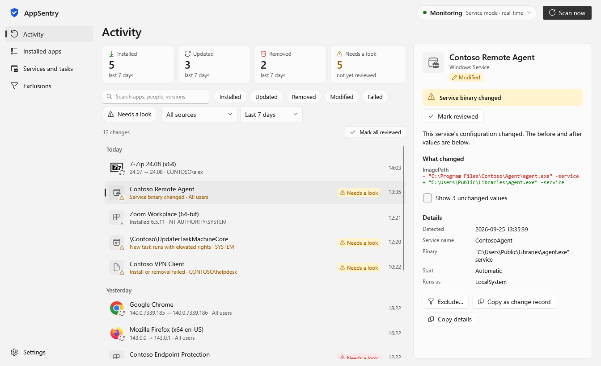
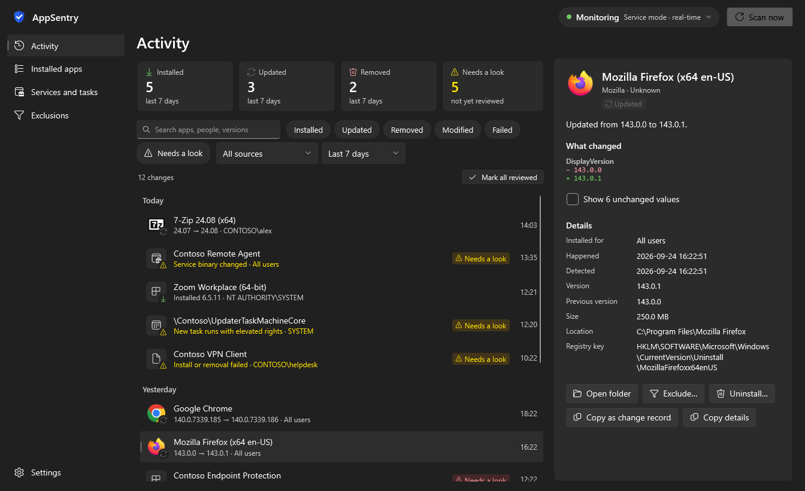
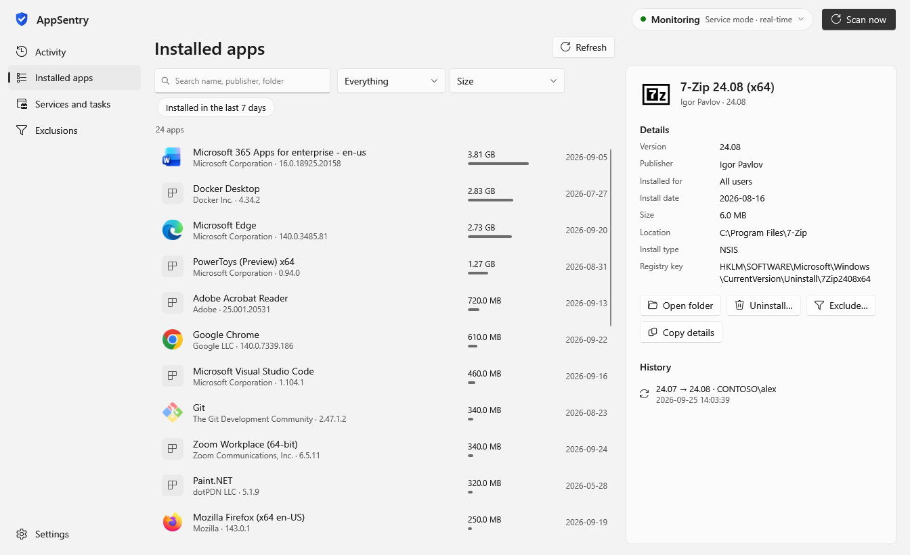
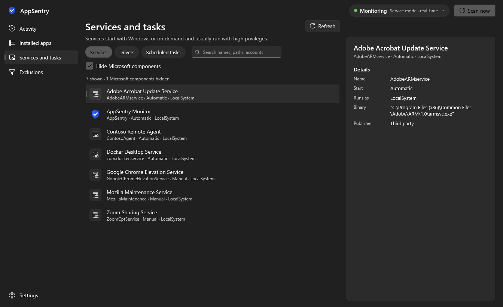
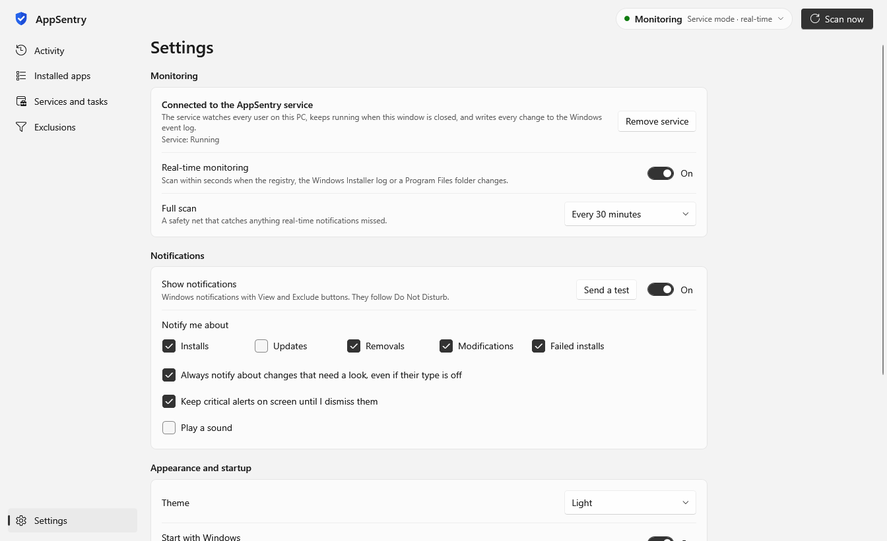

# AppSentry

An open-source Windows 11 application that monitors software installs, updates, and removals in real-time — similar to the install-tracking feature in IObit Uninstaller, but free and open source.

## Features

### Core Monitoring
- Detects **installed**, **updated**, **removed**, **modified** and **failed** installs from multiple sources:
  - Windows Registry: HKLM (64- and 32-bit) and every signed-in user's hive, including Entra ID accounts
  - Microsoft Store / MSIX packages (WinRT PackageManager API — no PowerShell)
  - Windows Event Log (MsiInstaller): catches silent/remote MSI installs, **who** ran them, and failures
  - Folders: `Program Files`, `Program Files (x86)` and each user's `%LOCALAPPDATA%\Programs`
  - Windows services, drivers and scheduled tasks — including changes to an existing service's binary or account, or a task's action
  - Scoop apps (which never touch the registry)
- **Real-time**: registry, event log and folder notifications trigger a scan within seconds; the interval scan is a safety net
- Upgrades that change the uninstall key (MSI major upgrades, 32→64-bit moves) are one **Updated** event, not remove + install
- A source that fails or can't be read (Store error, signed-out user, no elevation) never shows up as mass removals
- Identifies installer technology (MSI, WiX Bundle, InnoSetup, NSIS, InstallShield, Squirrel, ClickOnce, Store)
- Package-manager ownership from each manager's own records (**Chocolatey**, **Scoop**, **Winget**)
- Install **size** and the time the change **actually happened** are captured when it's detected

### User Interface
- Windows 11 **Fluent** look (WPF, .NET 9 Fluent theme): Mica, rounded corners, your accent color, light/dark following Windows or chosen in Settings
- **Activity**: changes grouped by day, with real app icons, summary cards for the chosen period, filter chips (type, source, time range, "needs a look") and search
- **Details pane** beside the list: what happened in one sentence, who did it, the before/after values that changed, and actions — open folder, uninstall, exclude, copy details, **copy as change record** (a bulleted write-up for a change ticket)
- **Installed apps**: every app with its icon, size bar, install date and scope filters (machine-wide, per-user, Store, Scoop), plus each app's own change history
- **Services and tasks**: every service, driver and scheduled task the engine tracks — what it runs and as whom — with Microsoft's own components hidden by default
- **Exclusions** edited in place, each showing how many past events it matches
- Crisp at any display scaling (per-monitor DPI aware), keyboard and screen-reader friendly

### Needs a look
Changes that deserve a human's eyes are flagged, counted on the Activity page and in the tray icon, and can be marked reviewed:
- failed installs, new drivers, tasks that run elevated, changed uninstall commands, programs dropped without an installer
- services whose binary or account changed — **critical** when a Microsoft binary is swapped for a non-Microsoft one
- removal of security software (CrowdStrike, Defender, SentinelOne, Wazuh, …)

The same rules set the Windows event log level (Error / Warning / Information), so a SIEM can alert on level alone.

### Notifications and tray
- **Native Windows notifications** with *View* and *Exclude* buttons; they follow Do Not Disturb and stay in Notification Center
- Choose which change types notify; anything that needs a look can always notify; critical alerts can stay on screen until dismissed
- **Tray icon** shows state (a dot when something needs a look, a pause badge while notifications are paused); its menu lists the latest changes and can pause notifications for 1 hour, 4 hours or until tomorrow
- Closing the window keeps AppSentry in the notification area (optional); **Start with Windows** opens it there quietly
- **Exclusions**: exact names, wildcards (`7-Zip*`, `[Scheduled Task] \Adobe*`) and version-free matching, so an exclusion keeps working after the app updates. Choose "don't notify" or "don't record at all".

### System Integration
- **Background service** (optional): runs as LocalSystem, covers every user, keeps monitoring when nobody is signed in; the tray app connects to it automatically
- Every change written to the **Windows Application log** (source `AppSentry`) for SIEM collection (e.g. Wazuh)
- **Export CSV** of the full history, including the attention reason for flagged items
- **History retention** (optional): keep everything (the default), or delete changes older than 1 month to 2 years, once a day
- Large histories stay fast: the list loads in pages without the bulky before/after registry values, which are fetched only for the change you open
- Single-instance: launching again brings the running window forward
- Configurable safety-net scan interval (1, 5, 10, 30 minutes, or off)

## Command line

| Switch | What it does |
|--------|--------------|
| *(none)* | Tray app. Connects to the service if it's running, otherwise monitors in-process |
| `--minimized` | Start hidden in the notification area (used by Start with Windows) |
| `--install-service` / `--uninstall-service` | Install or remove the background service (UAC prompt) |
| `--data-dir <path>` | Monitor in-process against another folder (testing, portable use) |
| `--demo [--synthetic]` | Sample data, no monitoring — for design review. With `--synthetic`, nothing comes from this PC |
| `--screenshots <dir> [--theme Light\|Dark] [--synthetic]` | Render every page with sample data to PNGs, then exit |
| `--export-icon <path>` | Write the app icon (.ico) |

## Screenshots

*Sample data (`AppSentry.exe --demo --synthetic`) — every app, service, task and account is made up.*

**Activity** — changes grouped by day, "needs a look" flags, and the details pane with the before/after diff:



**Activity in dark mode** — an update with the version diff:



**Installed apps** — icons, size bars and per-app history:



**Services and tasks** — what runs with Windows, with Microsoft's own components hidden:



**Settings:**



Regenerate them with `AppSentry.exe --screenshots <folder> --theme Light --synthetic` (or `--theme Dark`).

## How It Works

Everything that detects, schedules and stores lives in **AppSentry.Core**. The tray app talks to it through one interface, either in-process or over a named pipe to the service.

Each scan runs this pipeline, one scan at a time:

1. **MSI events** — new MsiInstaller events since the saved bookmark (read first, so everything they mention is visible to step 2)
2. **Inventory** — registry, Store and Scoop. Each *scope* (HKLM 64/32, each user's hive, each user's Store packages) is only compared if it was read in full this time; anything else is carried forward unchanged
3. **Diff** — installs, updates (same key, new version), modifications (same version, changed publisher/location/uninstaller) and removals, then **correlation**: a removal and an install of the same product in one scan become one update
4. **Enrich** — the event log's user and timestamp are attached to the matching registry change; failures and hidden MSI components are recorded on their own
5. **Folders** — new folders are held for 2 minutes (installers create the folder before the registry key), and any folder owned by a known app is skipped
6. **Services, drivers, tasks** — added, removed or reconfigured; Microsoft components are filtered the same way in both directions
7. **Commit** — exclusions are applied, then the events and every source's new baseline are written in **one SQLite transaction**

Real-time triggers (`RegNotifyChangeKeyValue`, `EventLogWatcher`, `FileSystemWatcher`) only ask for a scan (debounced 10 s); they never create events themselves.

## Service Mode

```bat
AppSentry.exe --install-service
AppSentry.exe --uninstall-service
```

`--install-service` copies AppSentry to `%ProgramFiles%\AppSentry`, registers a delayed-start service with restart-on-failure, and starts it (UAC prompt). `--uninstall-service` stops and removes it; history is kept. The **🛡 Install Service** toolbar button does the same.

When the service is running, the tray app shows "Service mode" and reads everything from it over `\\.\pipe\AppSentry`:

- Any signed-in user can view history and request a scan
- Clearing history and changing exclusions/settings need an administrator account (a normal, non-elevated admin session is enough)
- The tray app only trusts a pipe served from session 0, so another user can't impersonate the service

**Windows event log** (Application log, source `AppSentry`):

| Event ID | Change | Level |
|----------|--------|-------|
| 1000 | Installed | by attention |
| 1001 | Updated | by attention |
| 1002 | Removed | by attention |
| 1003 | Modified | by attention |
| 1004 | Failed | by attention |

"By attention" means the level follows the "needs a look" rules: Error for critical items (security software removed, a Microsoft service binary swapped for a non-Microsoft one), Warning for items that need a look, Information for everything else.

The message body is `Key: value` lines (App, Version, PreviousVersion, Publisher, ChangedBy, InstalledFor, Source, Key, OccurredAt, Details). Flagged items add an `Attention:` line.

## Requirements

- Windows 10 1809 or later / Windows 11
- [.NET 9 Desktop Runtime](https://dotnet.microsoft.com/download/dotnet/9.0) *(for running a framework-dependent build)*
- [.NET 9 SDK](https://dotnet.microsoft.com/download/dotnet/9.0) *(for building from source)*

## Build from Source

```bash
git clone https://github.com/vonkdj98/AppSentry.git
cd AppSentry

# Run in development
dotnet run --project AppSentry/AppSentry.csproj

# Run against a separate data folder (testing; runs beside a normal install)
dotnet run --project AppSentry/AppSentry.csproj -- --data-dir C:\Temp\AppSentryTest

# Tests. The integration tests scan this machine and make (and undo) harmless
# HKCU and scheduled-task changes; skip them with the filter.
dotnet test
dotnet test --filter "Category!=Integration"

# Build a single self-contained exe (no .NET runtime required)
dotnet publish AppSentry/AppSentry.csproj ^
  -c Release ^
  -r win-x64 ^
  --self-contained true ^
  -p:PublishSingleFile=true ^
  -p:IncludeNativeLibrariesForSelfExtract=true
```

The output exe will be in:
```
AppSentry\bin\Release\net9.0-windows10.0.19041.0\win-x64\publish\AppSentry.exe
```

## Data Storage

| Where | Mode | Contents |
|-------|------|----------|
| `%APPDATA%\AppSentry\appsentry.db` | Tray app on its own | History, inventory baseline, source bookmarks, exclusions, settings (SQLite) |
| `%ProgramData%\AppSentry\appsentry.db` | Service | Same, machine-wide; readable by SYSTEM and Administrators only |
| `engine.log` next to the database | Both | Diagnostics: scans, failures, trigger activity (rotates at 1 MB) |
| `%APPDATA%\AppSentry\*.txt` | Tray app | UI preferences: theme, sound, notification auto-hide, column layout |

Upgrading from v1: `history.json`, `exclusions.json` and `interval.txt` are imported on first launch and renamed to `*.imported`. The v1 `snapshot.json` is not imported; the first scan takes a fresh baseline so nothing is falsely reported. An unreadable database is moved aside (`appsentry.db.corrupt-<time>`), never overwritten.

## Project Structure

```
AppSentry.Core/                     # engine, no UI
  Engine/MonitorEngine*.cs          # scheduling, scan pipeline, real-time hookup
  Sources/                          # RegistrySource, StoreSource, MsiEventSource, FileSystemSource,
                                    # ServiceSource, TaskSource, PackageManagerSource
  Detection/                        # ChangeDetector (scopes, correlation), MsiCorrelator, ExclusionMatcher
  Storage/                          # SqliteStore, LegacyImporter
  Triggers/ChangeTriggers.cs        # registry / event log / folder change notifications
  Backend/                          # IMonitorBackend, LocalBackend, PipeBackend
  Ipc/                              # named-pipe protocol and server
  Service/                          # Windows service host, installer, event log writer
  Uninstaller.cs
AppSentry/                          # WPF tray app (Fluent theme)
  Program.cs                        # entry point: tray app, --service, --install-service, ...
  App.xaml                          # theme and shared styles
  Views/                            # MainWindow, Activity, Installed, Services and tasks, Exclusions, Settings
  ViewModels/                       # one per page, plus the shell (navigation, status, "needs a look")
  Services/                         # notifications, tray, app icons, brand icon, settings, exports
  Demo/                             # sample-data backend and the screenshot renderer
AppSentry.Tests/                    # xUnit: engine, storage, sources, pipe (integration tests touch this PC)
AppSentry.UiTests/                  # xUnit: view models (filters, paging, details, notification rules) against a fake backend
```

## Contributing

Contributions are welcome! Feel free to open issues or submit pull requests.

## License

MIT
